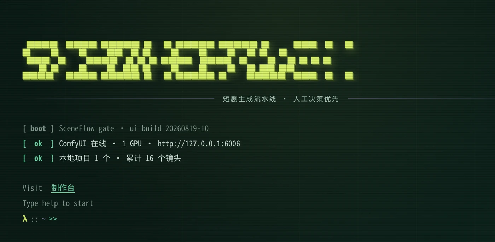
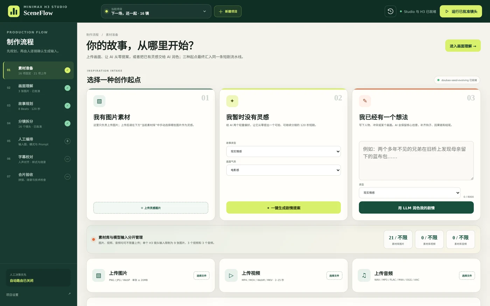
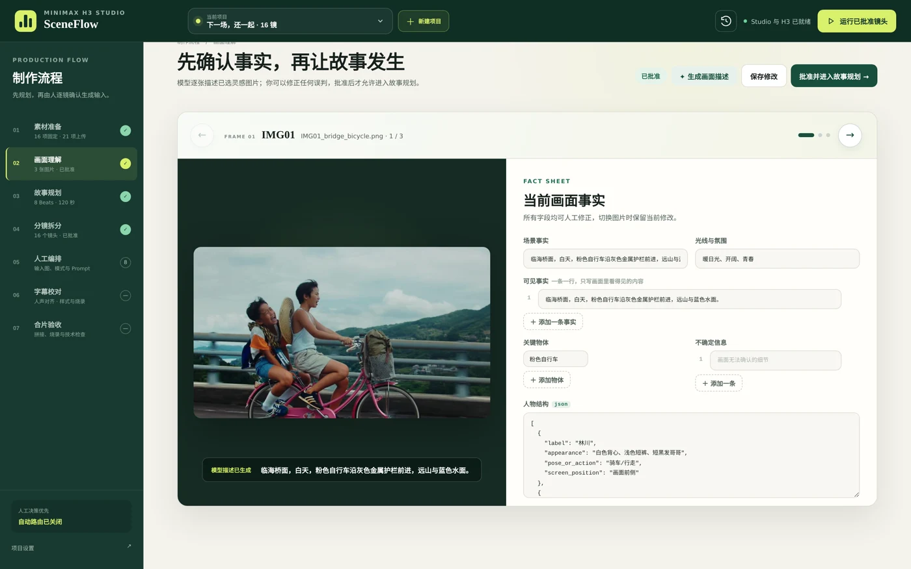
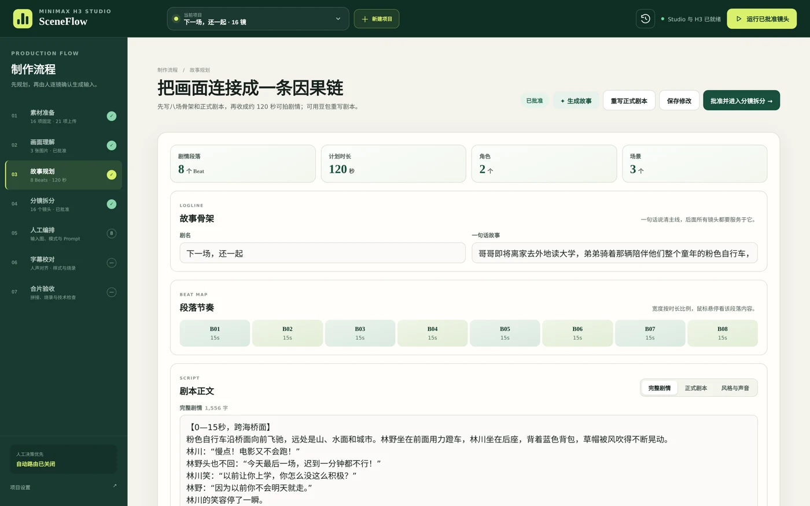
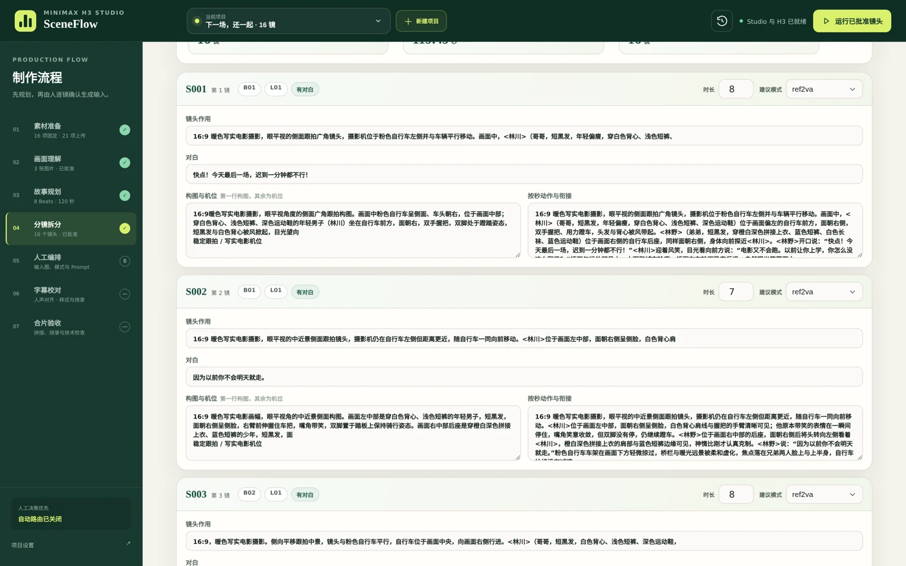
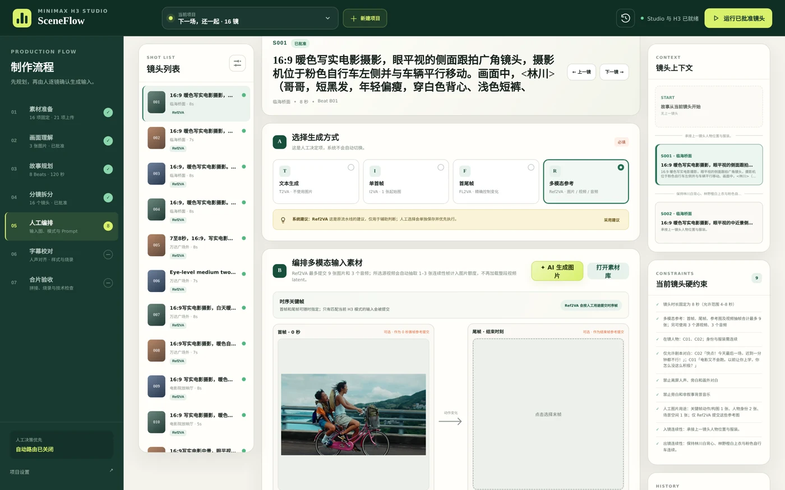
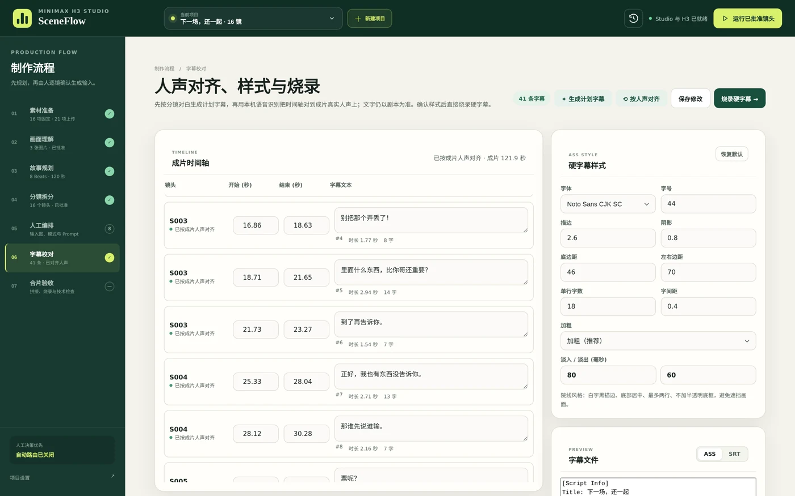
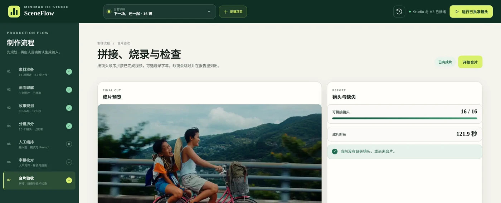
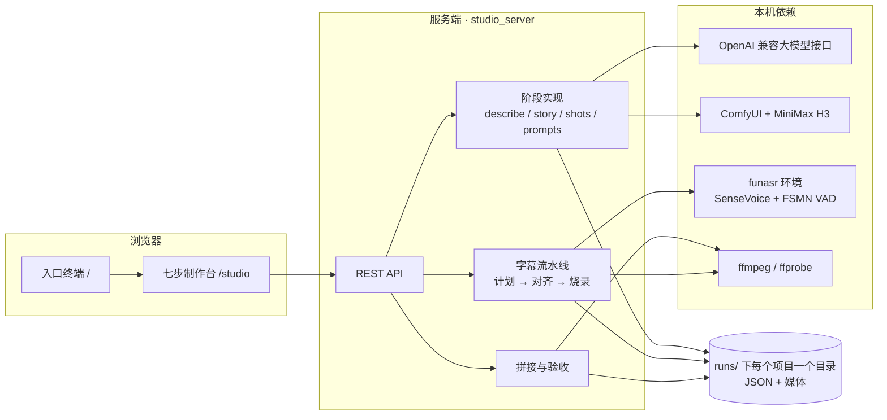

<div align="center">

# SceneFlow

**MiniMax H3 短剧生成流水线 · 人工决策优先**

从几张灵感图到一条带硬字幕的成片，七个阶段串成一条线。
每个阶段的产出都摊开在网页上可以逐字修改，批准之后才允许进入下一步。




</div>

---

## 目录

- [这是什么](#这是什么)
- [演示片](#演示片)
- [七个阶段](#七个阶段)
- [系统结构](#系统结构)
- [部署](#部署)
- [使用：网页工作台](#使用网页工作台)
- [使用：命令行](#使用命令行)
- [示例项目](#示例项目)
- [目录结构](#目录结构)
- [排错](#排错)
- [已知限制](#已知限制)
- [素材与致谢](#素材与致谢)

---

## 这是什么

SceneFlow 是一条本地运行的短剧生成流水线，外加一个网页工作台。视频生成走本机 ComfyUI 上的
MiniMax H3，规划与看图走任意 OpenAI 兼容的大模型接口，字幕时间轴用本机语音识别对齐成片里的
真实人声。所有中间产物都以 JSON 落盘在 `runs/<run_id>/` 下，既能在网页上改，也能用命令行跑。

它和“一句话出片”的工具不是同一类东西。这里的假设是：模型可以负责执行，但每一镜拍什么、
用哪张参考图、说哪句台词，应该由人拍板。因此流水线被切成七步，每一步都有产出、都能改、
都有闸门。


<div align="center"><sub>示例项目的成片画面，字幕为流水线自己烧录的硬字幕</sub></div>

### 几个设计要点

| 要点 | 说明 |
| --- | --- |
| **批准闸门** | 画面理解、故事、分镜三个阶段各有一个 `*.approved` 文件；没有它下游拒绝执行，重跑上游会自动作废下游批准 |
| **逐镜批准** | 第五步每一镜单独确认生成方式、参考图与最终提示词，只有被批准并锁定的镜头才会提交生成 |
| **混合路由** | 场景首镜与周期性重锚点走 Ref2VA，连续动作镜头用上一镜末帧走 I2VA，变化较大的镜头在关键帧就绪后走 FL2VA，纯文本兜底 T2VA |
| **一致性预处理** | 角色正/侧/背参考注册、镜头首尾分解、按镜头智能选参考图、关键帧生成与候选择优 |
| **字幕两条来源** | 文字始终来自已批准的分镜对白，时间轴来自成片里的真实人声，避免字幕与口型脱节 |
| **轻依赖** | 服务端只需要 5 个 pip 包；GPU 相关的重依赖都在 ComfyUI 和可选的语音识别环境里 |
| **数据可读** | 每个阶段的产出都是带 schema 的 JSON，可以直接用编辑器或脚本处理 |

---

## 演示片

一段 3 分钟的完整演示，讲清整套系统怎么用，画面全部是工作台的真实截屏与成片素材。

- 仓库内压缩版（约 44 MB、1080p、中文旁白 + 背景音乐）：`docs/sceneflow-demo.mp4`
- 原画质版（约 105 MB）：见本仓库的 Releases 页面

---

## 七个阶段

| # | 阶段 | 产出目录 | 人工要做的事 |
| --- | --- | --- | --- |
| 01 | 素材准备 | `inputs/` | 上传图片，或让模型出剧情提案，或写一段梗概让它扩写 |
| 02 | 画面理解 | `01_descriptions/` | 逐条核对可见事实、关键物体、不确定信息，然后批准 |
| 03 | 故事规划 | `02_story/` | 改剧名、一句话故事、角色、场景、段落节奏与正式剧本 |
| 04 | 分镜拆分 | `03_shots/` | 逐镜改镜头作用、对白、构图机位、逐秒动作、时长与生成方式 |
| 05 | 人工编排 | `05_videos/` | 逐镜定生成方式与输入素材，确认提示词后提交生成 |
| 06 | 字幕校对 | `06_subtitles/` | 生成计划字幕、按人声对齐、定样式、烧录 |
| 07 | 合片验收 | `07_final/` | 看拼接报告与缺失清单，预览成片 |

### 01 · 素材准备

三种起点汇进同一条流水线：已有画面素材、从零要提案、已经有想法要扩写。图片、视频、音频都可以入库，
单次提交给 H3 的参考图上限由配置控制。



### 02 · 画面理解

多模态模型逐张读图，只写画面里看得见的事实。可见事实一条一行，关键物体与不确定信息分开登记，
人物结构以 JSON 形式给出，全部可以人工改写后再批准。



### 03 · 故事规划

先出骨架：剧名、一句话故事、角色、场景；再排段落节奏，按时长比例铺成时间轴；最后收成正式剧本，
可以直接在页面里重写。总时长与目标时长的偏差在配置里设阈值。



### 04 · 分镜拆分

剧本被拆成一张张镜头卡：镜头作用、对白、构图与机位、逐秒动作、承接与衔接。时长和建议生成方式
在卡头就能改，校验会做 story 交叉检查（生成方式、依赖关系、末帧要求）。



### 05 · 人工编排

最关键的一步。逐镜选择生成方式（文本 / 单图 / 首尾帧 / 多图参考），指定输入素材，确认最终提示词；
右侧给出镜头上下文与硬约束，系统只提建议，不替人决定。确认后提交 ComfyUI，按末帧链依次生成。



### 06 · 字幕校对

先按分镜对白生成计划字幕，再用本机语音识别听出成片里的真实人声来对齐时间轴，文字仍以已批准的
对白为准。样式（字体、字号、描边、边距、单行字数、淡入淡出）可以在页面上调，预览 ASS/SRT 后烧录。



### 07 · 合片验收

按镜头顺序规范化、硬切拼接、烧录字幕，给出可拼接镜头数、成片时长与缺失清单，页面里直接预览。



---

## 系统结构



阶段之间只通过 `runs/<run_id>/` 下的文件通信，没有隐藏状态。网页停掉、换成命令行接着跑也可以。

---

## 部署

### 1. 环境要求

| 依赖 | 要求 | 说明 |
| --- | --- | --- |
| 操作系统 | Linux | 在 Ubuntu 上开发与验证 |
| Python | 3.11 及以上 | 服务端与命令行，实测 3.13 |
| ffmpeg / ffprobe | 系统安装即可 | 抽音轨、规范化、拼接、烧字幕 |
| 中文字体 | Noto Sans CJK SC 或同类 | 硬字幕渲染，烧录时需要字体文件路径 |
| ComfyUI | 已装好并能加载 MiniMax H3 | 视频生成，默认地址 `http://127.0.0.1:6006` |
| NVIDIA GPU | 能跑起 H3 的显存 | 权重为 int8 剪枝版本 |
| 大模型接口 | 任意 OpenAI 兼容服务 | 看图、写故事、拆分镜、优化提示词 |
| funasr 环境（可选） | 独立 Python 环境 | 字幕按人声对齐；不装则退回按对白时长排布 |

### 2. 取代码、装依赖

```bash
git clone <本仓库地址> sceneflow
cd sceneflow

python -m venv .venv
source .venv/bin/activate
pip install -r requirements.txt
```

`requirements.txt` 只有 5 个纯 Python 包：`openai`、`httpx`、`PyYAML`、`Pillow`、`jsonschema`。

### 3. 准备 ComfyUI 与 H3 权重

权重不在仓库里，需要下载到实际启动的那个 ComfyUI 的 `models` 目录：

```bash
# diffusion 权重(按需下载其中一个或两个)
#   Ref2VA:              minimax_h3_ref2va_pruned_int8_convrot.safetensors
#   FL2VA / I2VA / T2VA: minimax_h3_fl2va_pruned_int8_convrot.safetensors
# 文本编码器:
#   qwen3vl_32b_minimax_h3_nvfp4_awq.safetensors

# 下载完重启 ComfyUI,确认模型已注册
curl -s http://127.0.0.1:6006/object_info/UNETLoader
```

`workflows/minimax_h3_motion_context.json` 是与之对应的工作流参考（带 motion context）、
可以直接在 ComfyUI 里打开核对节点与参数；流水线提交任务时用的是同一套参数，
文件名与分辨率、步数都能在配置的 `comfyui` 段覆盖。

### 4. 可选：语音识别环境（字幕按人声对齐）

对齐这一步在独立进程里跑，所以它可以是另一个 Python 环境，不会污染服务端依赖：

```bash
conda create -n asr python=3.11 -y
conda activate asr
pip install funasr soundfile numpy torch   # 按自己的 CUDA 版本选 torch
# 再把 SenseVoiceSmall 与 speech_fsmn_vad_zh-cn-16k-common-pytorch 两个模型目录下载到本机
```

不配这一段也能出片：字幕会退回按对白时长排布，样式与烧录不受影响。

### 5. 改配置

配置是按机器走的，`configs/project.local.yaml` 是模板，复制或直接改都可以。**必须确认的几处：**

```yaml
input_images:                        # 起始锚点图,也可以之后从网页上传
  - assets/anchors/anchor_01_832x480.png

target_duration_s: 120               # 目标成片时长
default_shot_duration_s: 6           # 单镜时长与上下限(H3 单次生成 4–8 秒较稳)
min_shot_duration_s: 4
max_shot_duration_s: 8

llm:
  endpoint: https://<你的-openai-兼容服务>/v1
  model: <模型名>
  api_key_env: ARK_API_KEY           # 只写环境变量名,密钥不进配置文件

comfyui:
  base_url: http://127.0.0.1:6006
  width: 864                         # 与工作流一致
  height: 480
  ref2va_checkpoint: minimax_h3_ref2va_pruned_int8_convrot.safetensors
  fl2va_checkpoint: minimax_h3_fl2va_pruned_int8_convrot.safetensors
  text_encoder: qwen3vl_32b_minimax_h3_nvfp4_awq.safetensors

subtitles:
  asr:
    python: /path/to/asr-env/bin/python          # 装了 funasr 的解释器
    sensevoice_dir: /path/to/SenseVoiceSmall
    vad_dir: /path/to/speech_fsmn_vad_zh-cn-16k-common-pytorch
    device: cuda:0
  style:
    font_name: Noto Sans CJK SC
    max_chars_per_line: 18

image_generator:                     # 关键帧与角色肖像,用 OpenAI 兼容的 Images API
  enabled: true
  endpoint: https://<你的-images-服务>/v1
  model: <生图模型名>
  api_key_env: ARK_API_KEY
```

密钥只走环境变量：

```bash
export ARK_API_KEY='...'
```

`identity_consistency` 与 `consistency_pipeline` 两段控制一致性策略（重锚间隔、参考图上限、
是否生成关键帧、哪些变化幅度走 FL2VA），默认值可以直接用。

### 6. 启动服务

```bash
source .venv/bin/activate
python -m short_drama.studio_server \
  --config configs/project.local.yaml \
  --host 127.0.0.1 --port 4173
```

| 地址 | 页面 |
| --- | --- |
| `http://127.0.0.1:4173/` | 入口终端，开机自检显示后端与 ComfyUI 状态、本地项目数 |
| `http://127.0.0.1:4173/studio` | 七步制作台，刷新后停留在当前阶段 |

服务没有鉴权，只监听回环地址即可；需要远程访问时请用 SSH 端口转发，不要直接暴露到公网：

```bash
ssh -N -L 4173:127.0.0.1:4173 user@host
```

### 7. 冒烟验证

```bash
python -m unittest discover -s tests -v          # 67 个用例,不需要 GPU 与网络
curl -s http://127.0.0.1:4173/api/health         # 后端与 ComfyUI 状态
curl -s http://127.0.0.1:4173/api/bootstrap      # 本地项目列表
```

浏览器打开入口页，敲 `status` 看后端与 ComfyUI 是否都在线，再敲 `start` 进制作台。

---

## 使用：网页工作台

入口终端支持这些命令（也可以直接点“制作台”进去）：

| 命令 | 作用 |
| --- | --- |
| `help` | 列出所有命令 |
| `start` | 进入制作台（别名 `enter` / `studio` / `open`） |
| `flow` | 查看七个阶段 |
| `runs` | 列出本地项目 |
| `status` | 后端与 ComfyUI 状态 |
| `about` | 系统简介 |
| `clear` / `date` / `exit` | 清屏 / 当前时间 / 一句玩笑 |

进制作台之后的动线：

1. 顶部“新建项目”起一个 run，目录落在 `runs/<run_id>/`，顶部下拉可以随时切项目
2. 第一步选起点（上传素材 / 让模型出提案 / 写梗概扩写），然后“进入画面理解”
3. 每一步的绿色主按钮都是“批准并进入下一步”；左侧栏能看到每步的批准状态
4. 第五步逐镜确认后，用顶部“运行已批准镜头”批量提交生成
5. 第六步“生成计划字幕” → “按人声对齐” → 调样式 → “烧录硬字幕”
6. 第七步“开始合片”，完成后在页面里直接预览成片

批准是有向的：改了上游产出并重新批准，下游批准会作废，需要重新走一遍。

---

## 使用：命令行

不开网页也能跑完整流程：

```bash
export PYTHONPATH=$PWD

python -m short_drama.cli init --config configs/project.local.yaml
RUN=runs/<上一步输出的 run_id>

python -m short_drama.cli prepare-images  --run "$RUN"
python -m short_drama.cli describe-images --run "$RUN"
python -m short_drama.cli validate --run "$RUN" --stage descriptions
python -m short_drama.cli approve  --run "$RUN" --stage descriptions

python -m short_drama.cli plan-story --run "$RUN"
python -m short_drama.cli validate  --run "$RUN" --stage story
python -m short_drama.cli approve   --run "$RUN" --stage story

python -m short_drama.cli plan-shots          --run "$RUN"
python -m short_drama.cli prepare-consistency --run "$RUN"
python -m short_drama.cli check-continuity    --run "$RUN"
python -m short_drama.cli validate --run "$RUN" --stage shots
python -m short_drama.cli approve  --run "$RUN" --stage shots

python -m short_drama.cli render-prompts  --run "$RUN"
python -m short_drama.cli generate-videos --run "$RUN"

python -m short_drama.cli generate-subtitles --run "$RUN"
python -m short_drama.cli assemble --run "$RUN" \
  --env-prefix /usr \
  --font /usr/share/fonts/opentype/noto/NotoSansCJK-Regular.ttc
```

`--env-prefix` 指向包含 `bin/ffmpeg` 与 `bin/ffprobe` 的前缀目录（系统安装用 `/usr`，conda 环境用环境根目录）。`status` 子命令可以随时查看当前 run 的批准状态。

单镜 4–8 秒，二十镜左右的整片生成耗时很长，建议把 `generate-videos` 放在 `screen` 或 `tmux` 里跑。

---

## 示例项目

`runs/20260819T210000Z-next-scene-together` 保留了一个完整项目《下一场，还一起》的全部阶段产物，
可以直接在工作台里打开，逐步查看每一步的数据长什么样：

```text
inputs/                         参考图与首帧素材
01_descriptions/                画面理解结果
02_story/                       剧本、角色、场景、段落节奏
03_shots/                       16 张镜头卡与逐镜编排决策
04_prompts/                     渲染出的生成提示词
05_videos/S001..S016.mp4        16 个镜头片段
06_subtitles/                   计划字幕、人声对齐结果、ASS/SRT
07_final/studio_final_sub.mp4   122 秒带硬字幕成片
```

字幕这一段的数据可以对照着看：41 条字幕全部由第六步生成，时间轴对齐到成片里 24 段真实人声，
再烧成硬字幕。为了控制仓库体积，中间生成物（`05_videos/studio_generations/`）、无字幕版本与
抽出来的音轨没有入库，规则见 `.gitignore`。

---

## 目录结构

```text
sceneflow/
  short_drama/        Python 包:命令行、各阶段实现、网页服务、字幕与对齐
  studio/             前端:入口页 gate.* 与制作台 index.html / app.js / styles.css
  configs/            项目配置(按机器),只写密钥的环境变量名
  prompts/            规划与提示词渲染用的系统提示
  schemas/            各阶段产物的 JSON Schema
  workflows/          ComfyUI 工作流参考(MiniMax H3 + motion context)
  assets/anchors/     示例锚点图
  scripts/            辅助脚本(启动 ComfyUI、分块拆分镜等)
  tests/              unittest 用例
  docs/               README 用截图与演示片
  runs/               每个项目一个目录,仓库内保留一个示例项目
```

---

## 排错

| 现象 | 可能原因与处理 |
| --- | --- |
| 入口页显示 ComfyUI offline | ComfyUI 没起，或 `comfyui.base_url` 不对；先用 `curl <base_url>/system_stats` 确认 |
| 提交生成后立刻报模型不存在 | 权重没放进 ComfyUI 的 `models` 目录，或文件名与配置里的 `*_checkpoint` 不一致；重启 ComfyUI 后再查 `object_info/UNETLoader` |
| 看图或规划阶段报鉴权失败 | 环境变量名与 `api_key_env` 不一致，或启动服务的 shell 里没 export |
| 字幕对齐报找不到解释器 | `subtitles.asr.python` 路径不对，或那个环境里没装 `funasr` |
| 对齐结果只有少数几条匹配 | 成片人声与已批准对白差异过大；可先只用计划字幕，或回第四步校对对白 |
| 烧录字幕时中文变方框 | 字体缺失；安装 Noto CJK 或在 `subtitles.style.font_name` 换成本机已有的中文字体 |
| 命令行 `assemble` 报依赖不存在 | `--env-prefix` 下没有 `bin/ffmpeg`、`bin/ffprobe`，或 `--font` 指的不是字体文件 |
| 批准按钮点不动 | 上游阶段的 `*.approved` 被作废了，需要从上游重新 validate / approve |

---

## 已知限制

- 故事阶段会给角色输出 `reference_image_ids`，把锚点图里可辨识的人物绑成视觉参考；把人物改成
  另一性别、年龄或服装会破坏一致性策略
- 重跑 `prepare-consistency` 会改写 `shots.json` 并作废 `shots.approved`，必须重新 validate / approve
- 变化幅度中等及以上的镜头只在关键帧就绪后才走真正的 FL2VA，不会伪造末帧
- 缺字段的旧 `story.json` 不会被当作已启用一致性处理，默认要求重新 `plan-story`
- 网页服务没有鉴权，设计上只面向本机使用
- 目前没有做生成后的人脸 / 语义自动一致性检测，一致性仍依赖参考图策略与人工验收

---

